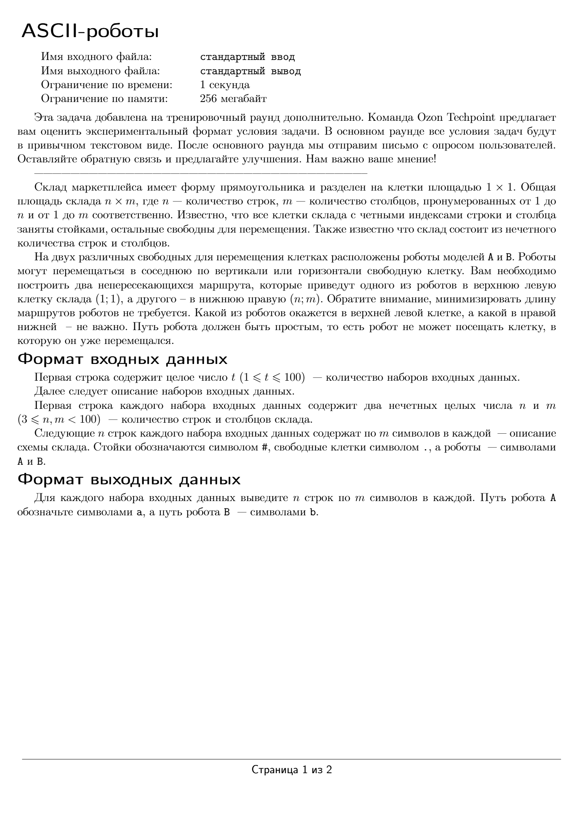
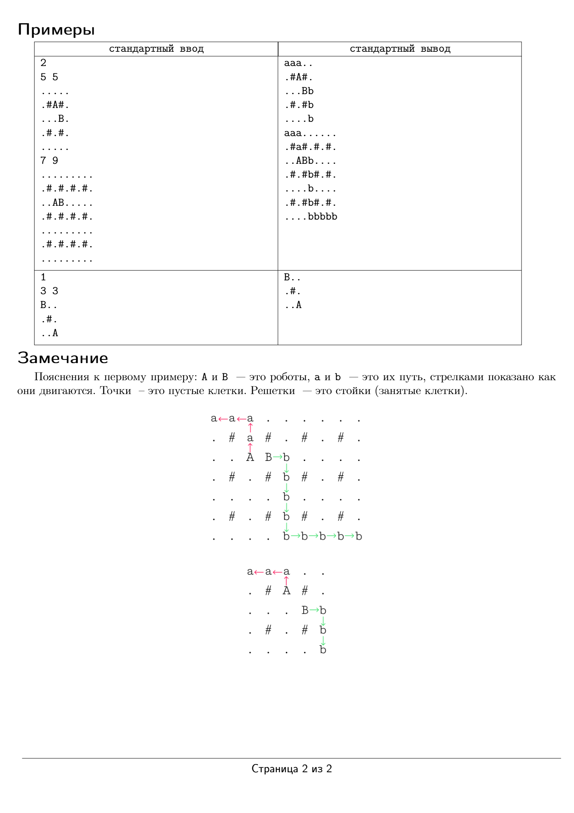

# ASCII-роботы
> За полное решение можно получить 20 баллов





## Пример теста 1
```plaintext
Входные данные
1
3 3
B..
.#.
..A
```
```plaintext
Выходные данные
B..
.#.
..A
```

## Пример теста 2
```plaintext
Входные данные
2
5 5
.....
.#A#.
...B.
.#.#.
.....
7 9
.........
.#.#.#.#.
..AB.....
.#.#.#.#.
.........
.#.#.#.#.
.........
```
```plaintext
Выходные данные
aaa..
.#A#.
...Bb
.#.#b
....b
aaa......
.#a#.#.#.
..ABb....
.#.#b#.#.
....b....
.#.#b#.#.
....bbbbb
```
