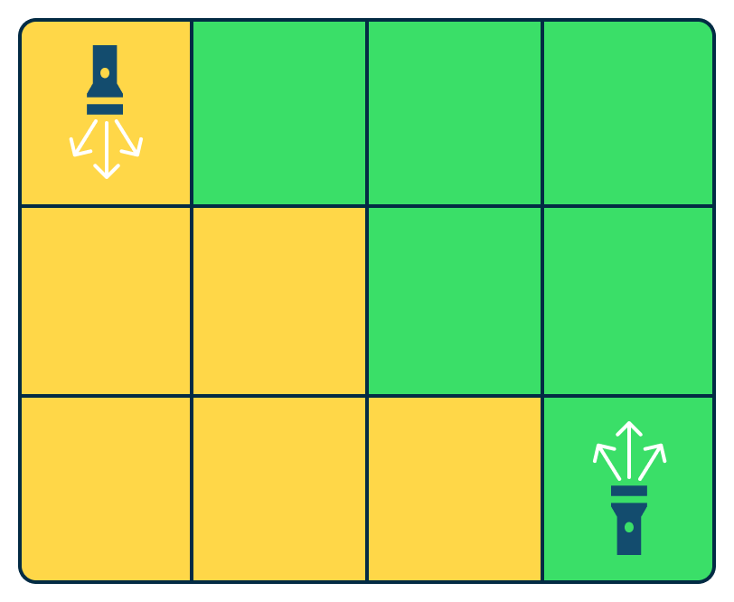

# Dark room
> За частичное решение можно получить 5 баллов, за полное — 11 баллов

## Условие задачи
У Коли дома отключился свет, а он очень боится темноты, но, к счастью,
с помощью фонариков можно осветить комнату.
Помогите Коле узнать, сколько нужно фонариков и их координаты и направление,
чтобы комната Коли была полностью освещена?

Вам даётся комната размером n в длину и m в ширину.
Вам нужно ввести **минимальное** количество необходимых фонариков,
а на следующих строках — их координаты и направление для полного освещения.
В одной координате не может быть больше одного фонарика.

Координата в данной системе может быть охарактеризована в виде пары (x, y) где:
* x - координата по оси X, которая направлена вертикально вниз  от 1 до n;
* y — координата по оси Y, которая направлена горизонтально вправо от 1 до m;

Если фонарик находится в координате (i, j), он освещает эту начальную координату.

Затем, в зависимости от направления фонарика, рекурсивно освещает координаты:
* Если фонарик направлен вниз (D), освещаются координаты: (i + 1, j - 1), (i + 1, j), (i + 1, j + 1).
* Если фонарик направлен вверх (U), освещаются координаты: (i - 1, j - 1), (i - 1, j), (i - 1, j + 1).
* Если фонарик направлен влево (L), освещаются координаты: (i - 1, j - 1), (i, j - 1), (i + 1, j - 1).
* Если фонарик направлен вправо (R), освещаются координаты: (i - 1, j + 1), (i, j + 1), (i + 1, j + 1).

Освещение фонарика двигается рекурсивно в том же направлении, пока луч не достигает стены.

## Входные данные
Первая строка содержит t (1 ≤ t ≤ 10\^5) — количество наборов входных данных.

Целые числа n, m (1 <= n,m <= 10\^9) — размер комнаты.


## Выходные данные
n — количество фонариков;

x, y, d — координата и направление.

Если существует несколько возможных ответов, вы можете вывести **любой**.

Иллюстрация к первому тестовому набору из примера:


Иллюстрация ко второму тестовому набору из примера:



Иллюстрация к третьему тестовому набору из примера:


## Пример теста 1
```plaintext
Входные данные
3
3 4
1 4
3 3

Выходные данные
2
1 1 D
3 4 U
1
1 1 R
2
1 1 R
3 3 L
```
