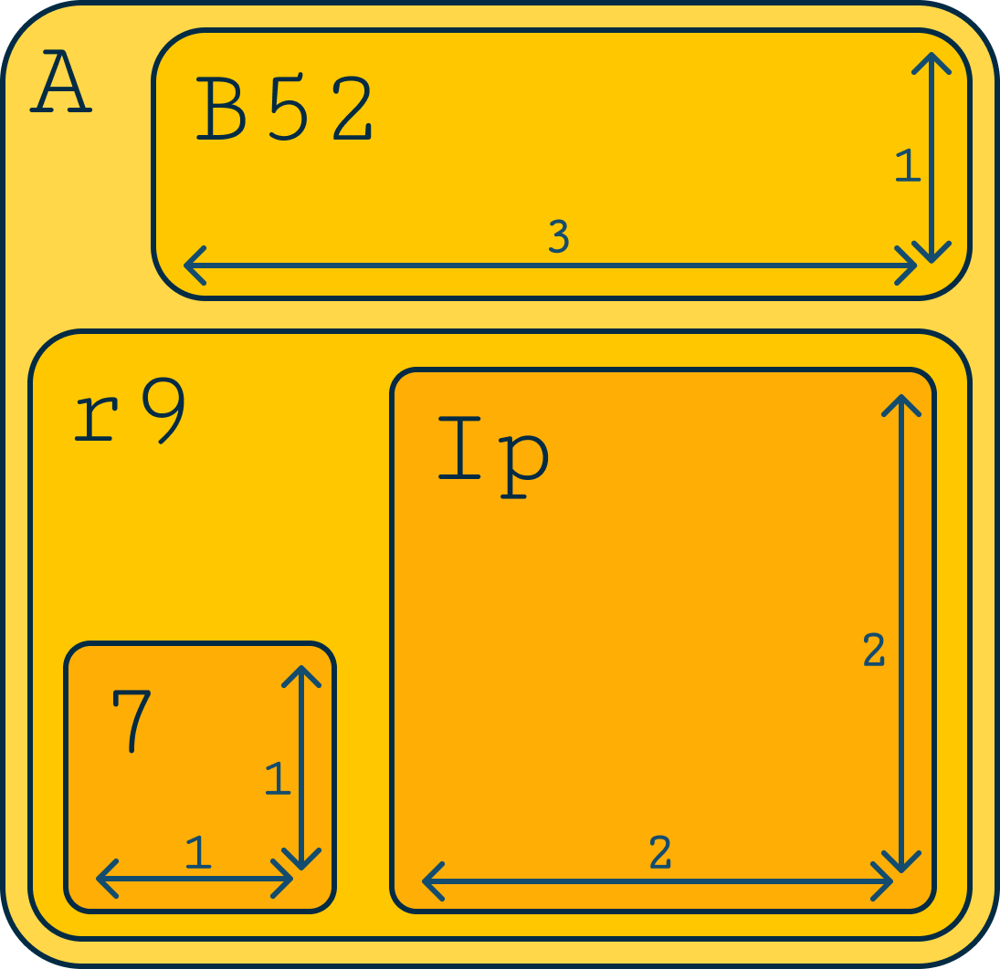

# Коробки. Коробки. Коробки
> За частичное решение можно получить 11 баллов, за полное — 23 балла

## Условие задачи
Вы работаете в компании, занимающейся логистикой и доставкой товаров.
Ваша задача — разработать систему для отслеживания перемещения коробок внутри склада. 

Коробка размером *a* на *b* представлена в матрице из ASCII-символов в виде прямоугольника,
где *a* символов в ширину и *b* символов в длину (см. пример).
Коробки также могут быть вложены друг в друга для удобства транспортировки и хранения.
Каждая коробка в левом верхнем углу имеет уникальный номер,
состоящий из букв латинского алфавита и цифр, длиной не больше 3 символов.

Чтобы было удобнее хранить данные о перемещении коробок, представьте все коробки,
учитывая их вложенность друг в друга, в формате JSON.
А для коробок, в которых нет вложенных коробок, выведите их площадь (см.пример).

## Входные данные
Каждый тест состоит из нескольких наборов входных данных.

Первая строка содержит целое число t (1 <= t <= 10\^4) — количество наборов входных данных.

Первая строка каждого набора входных данных состоит из двух целых чисел N и M (3 <= N, M <= 3⋅10\^5). 
Гарантируется, что сумма N⋅M по всем тестам не больше 10\^6.

Далее описана матрица из N строк по M имволов каждая.

Матрица состоит из символов «**.**», «**+**», «**-**», «**|**» для описания коробок,
а также латинских символов и цифр для описания названий коробок.
Коробки не пересекаются и не совпадают по своим границам.


## Выходные данные
Выведите структуру коробок в формате JSON, где для коробок без вложенности представлена их площадь.
Порядок вывода коробок внутри одной коробки не имеет значения.

Размер выходных данных не должен превосходить 20МБ.

Иллюстрация к первому набору из примера:



## Пример теста 1
```plaintext
Входные данные
5
11 12
+----------+
|A+---+....|
|.|B52|....|
|.+---+....|
|+-------+.|
||r9.+--+|.|
||+-+|Ip||.|
|||7||..||.|
||+-++--+|.|
|+-------+.|
+----------+
3 3
...
...
...
3 5
+---+
|I63|
+---+
8 9
+------+.
|256...|.
|......|.
|......|.
+------+.
....+---+
....|R..|
....+---+
3 9
+-++-++-+
|2||5||6|
+-++-++-+

Выходные данные
[
  {
    "A": {
      "B52": 3,
      "r9": {
        "7": 1,
        "Ip": 4
      }
    }
  },
  {},
  {
    "I63": 3
  },
  {
    "256": 18,
    "R": 3
  },
  {
    "2": 1,
    "5": 1,
    "6": 1
  }
]
```
